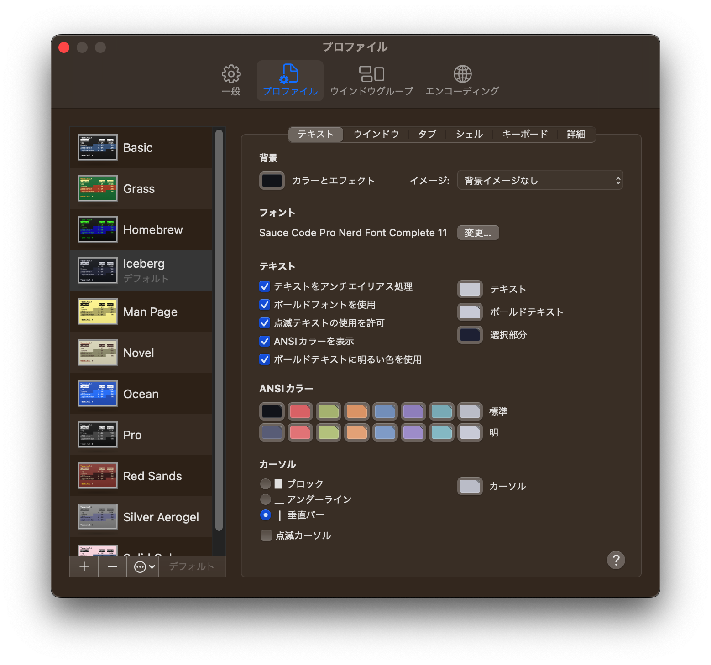
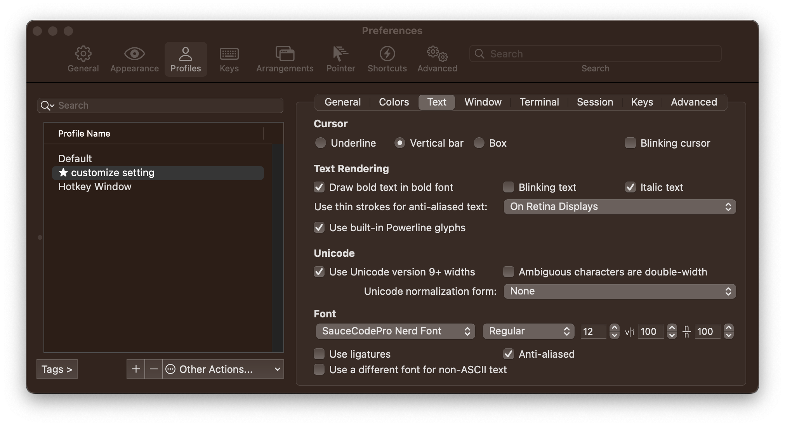
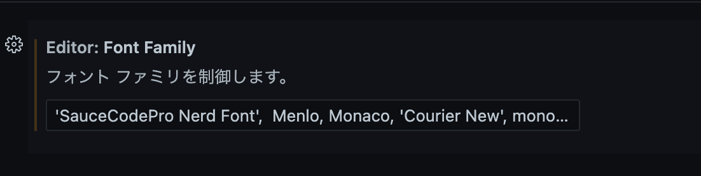

# ターミナルの環境構築

## 表示

プロンプトに [`starship`](https://starship.rs/) を利用するため、Rustをインストールします。

```sh
curl --proto '=https' --tlsv1.2 -sSf https://sh.rustup.rs | sh
```

`cargo` で `starship` をインストールします。

```sh
cargo install starship
```

自分は zsh を利用しているため、 `.zshrc` に以下の処理を追記します。

```sh
# ~/.zshrc

eval "$(starship init zsh)"
```

Nerd フォントが無いと、一部のアイコンが表示されないため、[サイト](https://www.nerdfonts.com/)から好きなフォントをダウンロードしてインストールします。
設定後、ターミナルの設定を開き、プロファイルからフォントを先ほどダウンロードしたフォントに変更します。



同様に、iTerm2・VSCodeのフォントの設定も変更します。




```text
# iTerm2の設定 Profile を json 書き出ししたもの
https://github.com/usagrada/dotfiles/blob/main/Profiles.json
```

```text
# VSCodeのフォントの設定
'SauceCodePro Nerd Font',  Menlo, Monaco, 'Courier New', monospace
```

これでいい感じの表示がされるようになりました。


## zsh のプラグイン管理

zsh でプラグインを管理するために`zinit`を追加する。

```sh
bash -c "$(curl --fail --show-error --silent --location https://raw.githubusercontent.com/zdharma-continuum/zinit/HEAD/scripts/install.sh)"
```

[ここ](https://github.com/usagrada/dotfiles/blob/main/.zsh_conf/zinit.zsh)に現在入れているプラグイン類は全て書いてある。

## プログラミング言語のバージョン管理

`asdf` でまとめて管理している。
自分は上記のzinitでインストールしている。

```sh
# .zshrc
zinit light asdf-vm/asdf
```

## その他便利コマンド

主にcargo でインストールして管理している。
既存のコマンドより個人的に便利なので入れているものが多い。
`zoxide`, `fd-find` はほぼ必須

```sh
bat v0.22.1:
    bat
bingrep v0.11.0:
    bingrep
bottom v0.8.0:
    btm
choose v1.3.4:
    choose
du-dust v0.8.4:
    dust
exa v0.10.1:
    exa
fd-find v8.7.0:
    fd
git-delta v0.15.1:
    delta
hexyl v0.12.0:
    hexyl
lscolors v0.13.0:
    lscolors
procs v0.13.4:
    procs
rargs v0.3.0:
    rargs
ripgrep v13.0.0:
    rg
sd v0.7.6:
    sd
silicon v0.5.1:
    silicon
starship v1.13.1:
    starship
tealdeer v1.6.1:
    tldr
tokei v12.1.2:
    tokei
zellij v0.34.4:
    zellij
zoxide v0.9.0:
    zoxide
```
